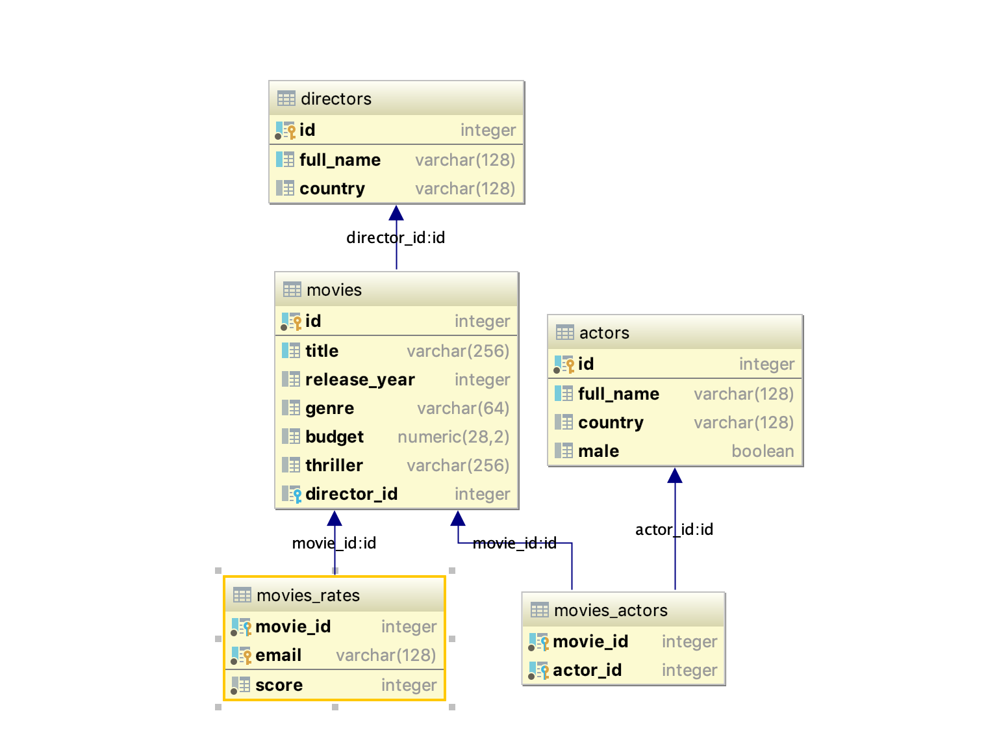

# Set up your environment

## Download the project

Clone the repository

```bash
git clone https://github.com/wesovilabs-workshops/workshop-graphql-nodejs.git
cd workshop-graphql-nodejs
```

## Project organization


> Project follows the guidelines for structuring a NodeJS project

In this project you will find two separated directories:

### Javascript code

- **src**: It contains the source code for the application


### Docker and configuration files

- **resources/graphql**: It contains the GraphQL schema implemented by the API.

- **resources/docker-compose**: It contains the docker-compose descriptor and the containers configuration files.

- **resources/local**: It contains default configuration file that will be used when running the server locally.. 

## Running the server

From the root directory you just need to execute

```bash
make deploy
``` 

or in case of you don't have make command installed 


```bash
docker build -t=wesovilabs/workshop-graphql-nodejs:local .;
docker-compose -f resources/docker-compose/docker-compose.yml run --rm -p9001:9001 api
```

To clean the launched containers you just need to perform

```bash
make docker-stop
```

or 

```bash
docker-compose -f docker-compose/docker-compose.yml down -v
```

### While you're coding

The above commands launch the full environment: database and API. On the other hand,
when we're coding we could rather launch the database from the docker-compose and the 
API from our local machine.

1. Launching database container from docker-compose

```bash
make database
```

or 

```bash
docker-compose -f src/main/resources/docker-compose/docker-compose.yml run --rm -p5456:5432 database
```

2. Run the application from your IDE or by command line

```bash
npm install;
APP_CONFIG_PATH=./resources/local/config.json NODE_ENV=local npm start;
```

## The application

### Database 



Databases will be populated with below data when postgres container is launched. 

Table: directors

           id         full_name        country
-------------  ----------------  -------------
            1        Tim Burton            USA
            2     James Cameron         Canada
            3  Steven Spielberg            USA
            4   Martin Scorsese             UK
            5  Alfred Hitchcock            USA
            6    Clint Eastwood             UK
            
Table: actors

           id         full_name        country         male
-------------  ----------------  -------------  -----------
            1       Johnny Depp            USA         true
            2     Winona Ryder             USA        false
            3  Russell Crowe         Australia         true
            4   Joaquin Phoenix            USA         true
            5  Al Pacino                   USA     true
            6  Robert de Niro              USA     true
            
Table: movies

           id                       title    release_year        genre       budget                thriller    director_id
-------------  ---------------------------  -------------  -----------  -----------  ----------------------  -------------
            1       Edward Scissorhands         1990            SciFi       20        https://www.yout...       1
            2       Gladiator                   2000            Drama       103       https://www.yout...       7
            
            
            
Table: movies_actors

     movie_id          actor_id
-------------  ----------------
            1       1
            1       2
            2       3
            2       4
            
### API

By defualt the below operations are already implemented in our project.

#### Queries

- **listDirectors:[Director!]**: It returns the list of directors.
- **listActors:[Actor!]**:It returns the list of actors.
- **listMovies:[Movie!]**: It returns the list of movies.
- **getMovie(movieId:ID!):Movie**: It returns the movie with given id.

#### Mutations

- **addMovie(request:MovieRequest):Movie!**: It adds a new movie.
- **addActor(request:ActorRequest):Actor!**: It adds a new actor. 
- **deleteActor("Identifier of the actor" actorId:ID!):[Actor!]**: It 
deletes the actor with the given id.

#### Subscriptions

- **listenDirectorMovies(directorId:ID!):Movie!**: It open a communication with 
the server and It is notified when a new movie is created for the directorId in the request.


### GraphQL schema

The full GraphQL schema looks

```graphql
schema {
    # The query root of Workshop GraphQL interface.
    query: Query
    # The root query for implementing GraphQL mutations.
    mutation: Mutation
    # The root query for implementing GraphQL subscriptions.
    subscription: Subscription

}

"""Available queries for Workshop API"""
type Query {
    """It returns the list of directors."""
    listDirectors:[Director!]
    """It returns the list of actors."""
    listActors:[Actor!]
    """It returns the list of movies."""
    listMovies:[Movie!]
    """It returns the movie with the fiven id"""
    getMovie("Movie identifier" movieId:ID!):Movie
}

"""Available mutations for Workshop API"""
type Mutation {
    """I adds a new movie"""
    addMovie(request:MovieRequest):Movie!
    """I adds a new actor"""
    addActor(request:ActorRequest):Actor!
    """I deletes an actor with the fiven identifier"""
    deleteActor("Identifier of the actor" actorId:ID!):[Actor!]
}

"""Available subscriptions for Workshop API"""
type Subscription {
    """It returns the movies for a given director"""
    listenDirectorMovies(directorId:ID!):Movie!
}


"""Request info for creating a movie"""
input MovieRequest {
    "Name of the movie"
    title: String!
    "Year when the movie was released"
    year: Int
    "Genre for the movie, supported values should be: SciFi, Drama, Comedy or Action"
    genre: String
    "Budget for the movie, the value is provided in Euro"
    budget: Float!
    "URL in which we can watch the thriller of this movie"
    thriller: String
    "Identifier of director"
    directorId: ID!
}

"""Movie details"""
type Movie {
    "Unique identifier for each movie"
    id: ID!
    "Name of the movie"
    title: String!
    "Year when the movie was released"
    year: Int
    "Genre for the movie, supported values should be: SciFi, Drama, Comedy or Action"
    genre: String
    "Budget for the movie, the value is provided in Euro"
    budget: Float!
    "URL in which we can watch the thriller of this movie"
    thriller: String
    "The director details of the movie"
    director: Director!
    "List of actors for the movie"
    actors("Total of returned actors" total:Int=1): [Actor!]
}

"""Director details"""
type Director{
    "Unique identifier for each director"
    id: ID!
    "Full name of the director"
    fullName: String!
    "Country in which the director was born"
    country: String
}

"""Actor creation info"""
input ActorRequest {
    "Full name of the director"
    fullName: String!
    "Country in which the actor was born"
    country: String
    "Gender of actor: Supported values are male or female"
    gender: String
}

"""Actor details"""
type Actor {
    "Unique identifier for each actor"
    id: ID!
    "Full name of the actor"
    fullName: String!
    "Country in which the actor was born"
    country: String
    "Gender of actor: Supported values are male or female"
    gender: String
}
```