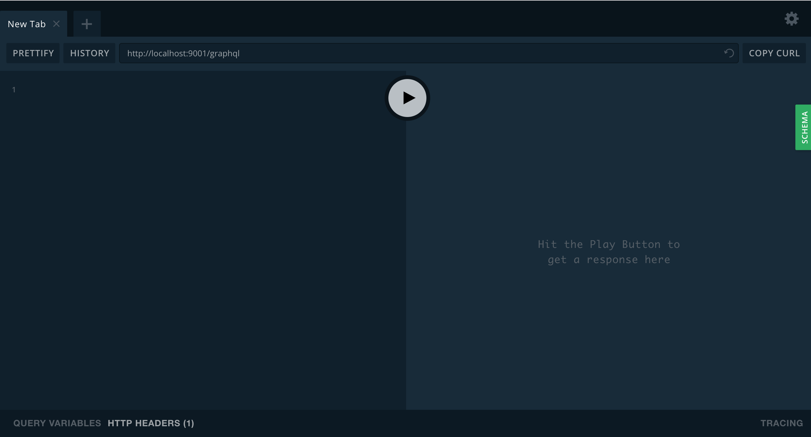
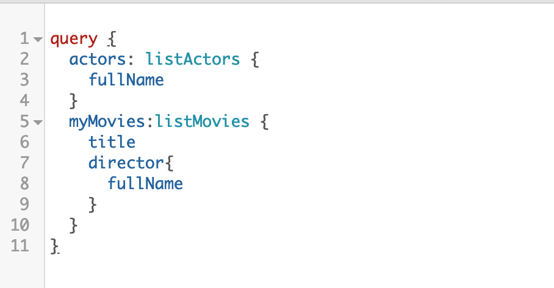
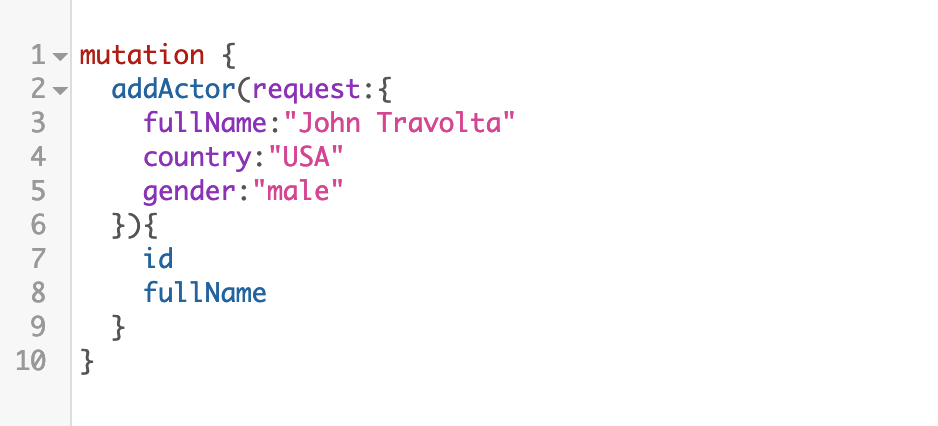
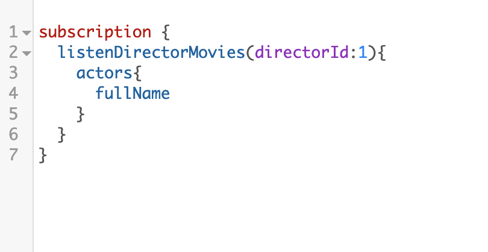
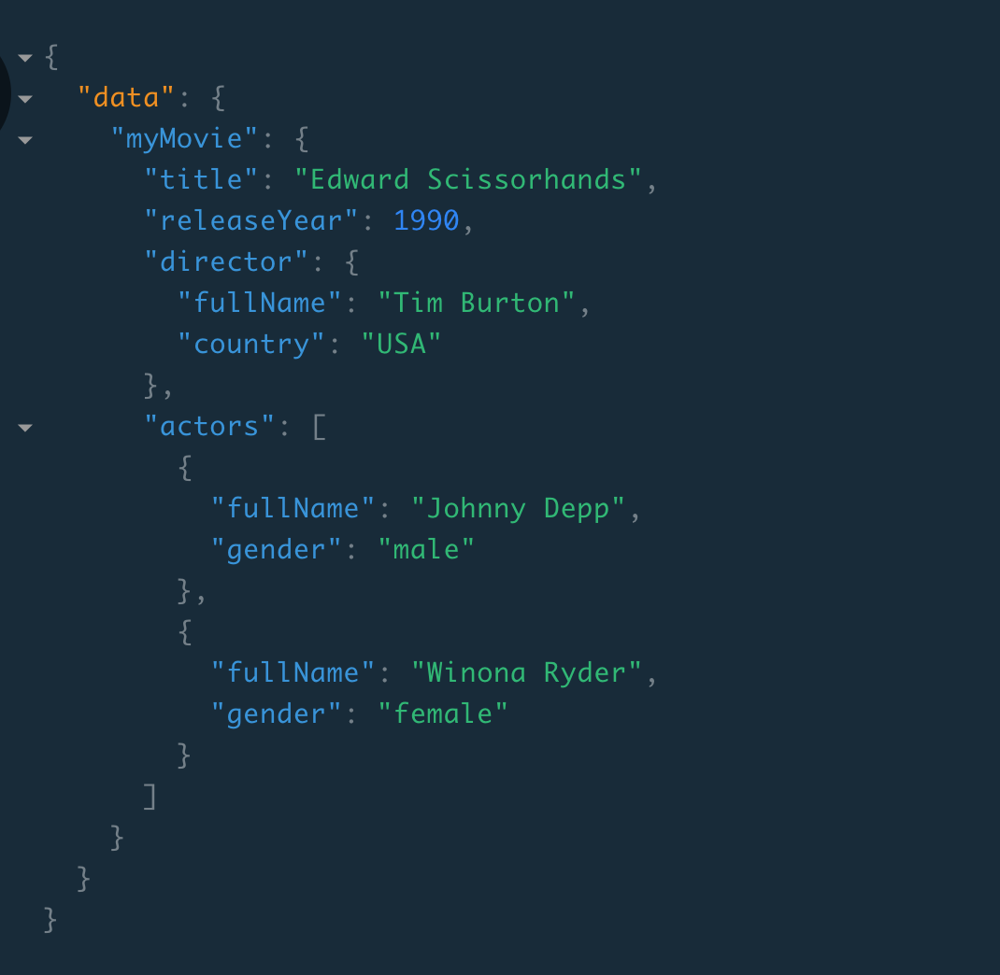

# The GraphQL Playground

## Introduction

Once the server is up and ready we can interact with our API by making use of the **GraphQL Playground**. 

Just open [ohttp://localhost:9001/graphql](http://localhost:9001/graphql) in your browser.

Queries are written on the left side and the response of these are displayed 
on the right one. 

To check the **API documentation** we just need to click on the green button on the right (SCHEMA) and a handy  menu will
be shown.

## GraphQL syntax
GraphQL operations are: queries, mutations and subscriptions. We can run only one operation per request.

On the other hand we can send more than a query or more than a mutation
at time. 

## Challenges

1. Write a query that returns the below details (**getMovie**) for movie with **id 1**.

   

- How many actors are returned from the server?

- Are the returned fields the same ones that appear in the picture?

2. Create a new director (**addDirector**)
3. Subscript to the movies for the created director in the previous step. (**listenDirectorMovies**)
4. Open another tab in your GraphQL Playground and add a new movie in which the director is the one that you just created. (**addMovie**). 
5. Verify that new movie has been notified to the subscription that we launched in step 3.
