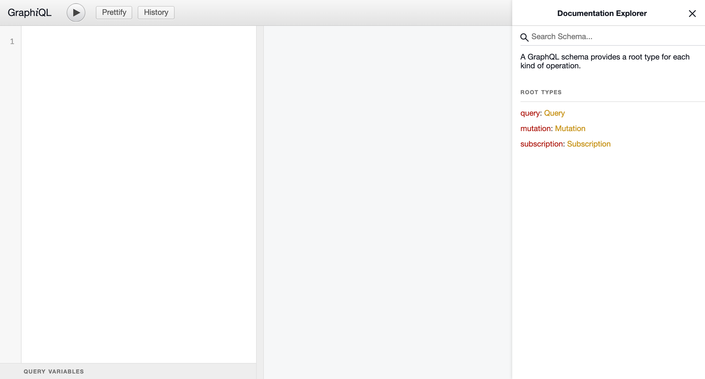
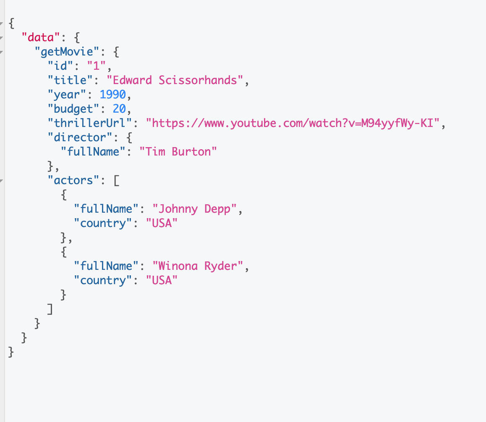

# The GraphQL Playground

## Introduction

Once the server is up and ready we can interact with our API by making use of the **GraphQL Playground**. There are
several desktop applications that allow us to run our queries against GraphQL API's. On the other hand, to follow the
workshop we will make use of an embedded web client which is deployed within out api.

Just open [ohttp://localhost:9001/graphiql](http://localhost:9001/graphiql) in your browser.

Learn to use  Graphiql is  not rock science. We will write our queries on the left panel and the result will be
displayed on the right panel. 

To check the **API documentation** we just need to click on  button on the right (< Docs) and a handy  menu will
be shown.  

## GraphQL syntax

On the below picture we can observe how queries, mutations and subscriptions are made from the Graphiql. Beer in mind
that you can only run one ot these three operations at time. On the other hand you can perform several queries or several mutations
at time. Have a look at the examples to understand how queries cna eb executed.

## Challenges

1. Write a query that returns the below details (**getMovie**)

   

- How many actors are shown?

- The returned fields in the picture are the same that the returned by your query?

2. Create a new director (**addDirector**)
3. Subscript to the movies for the created director in the previous step. (**listenDirectorMovies**)
3. Open another tab in your GraphQL Playground and add a new movie in which the director is the one that you just created. (**addMovie**). 
4. Verify that new movie has been notified to the subscription that we launched in step 3.
